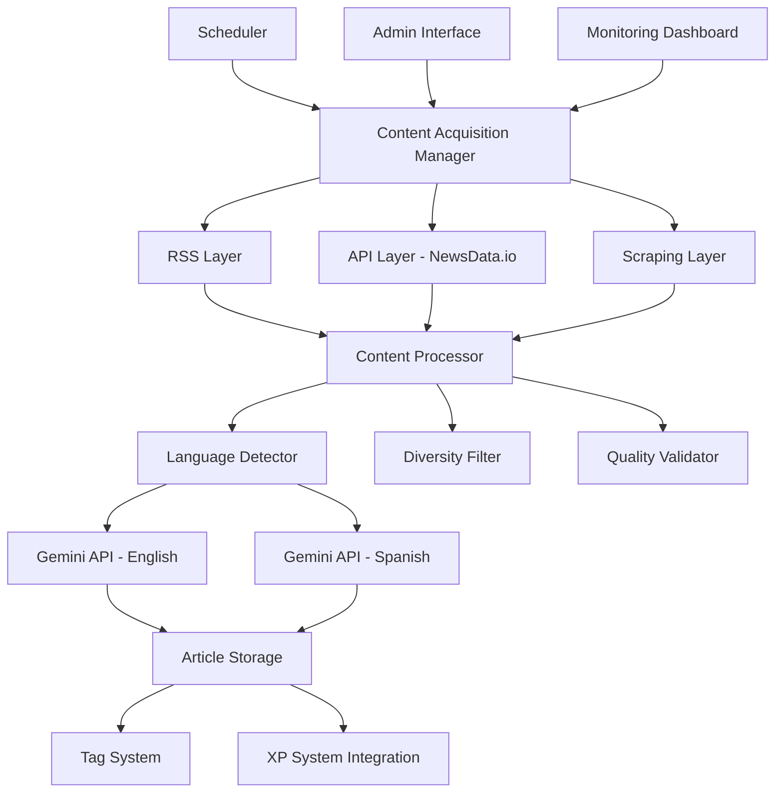

# Automated Content Acquisition System - Design Document

## Overview

The Automated Content Acquisition System is a multi-layered, intelligent content ingestion pipeline that continuously acquires news articles from diverse sources in English and Spanish. The system implements sophisticated content diversity algorithms, respects API rate limits, and ensures proper language-specific processing for both articles and quiz generation.

## Architecture

### High-Level Architecture



### Component Architecture

The system follows a modular architecture with the following key components:

1. **Content Acquisition Manager**: Central orchestrator that manages all acquisition layers
2. **Multi-Layer Ingestion**: RSS, API, and scraping layers working in harmony
3. **Content Processing Pipeline**: Language detection, diversity filtering, and quality validation
4. **Language-Aware LLM Integration**: Separate processing paths for English and Spanish content
5. **Admin Control System**: Management interface for monitoring and control

## Components and Interfaces

### 1. Content Acquisition Manager

**Purpose**: Central coordinator for all content acquisition activities

**Key Methods**:
- `run_acquisition_cycle()`: Executes a complete acquisition cycle
- `check_api_limits()`: Monitors and enforces API rate limits
- `distribute_acquisition_load()`: Balances load across sources
- `handle_acquisition_errors()`: Manages error recovery and logging

**Configuration**:
```python
ACQUISITION_CONFIG = {
    'cycle_interval_hours': 4,
    'max_articles_per_cycle': 50,
    'max_articles_per_topic_per_language': 4,
    'api_limits': {
        'newsdata_io': {'daily': 2000, 'current': 0},
        'gemini': {'daily': 1000, 'current': 0}
    }
}
```

### 2. RSS Feed Manager

**Purpose**: Manages RSS feed ingestion from curated sources

**English Sources**:
- BBC News, Reuters, CNN, The Guardian, NPR
- The New York Times, Al Jazeera English, Politico
- The Economist, Bloomberg

**Spanish Sources**:
- La Opinión, Univision, El Nuevo Herald, Clarín
- El País, BBC News Mundo, RTVE, SBS Español

**Key Features**:
- Feed validation and monitoring
- Automatic fallback to alternative feeds
- Content extraction for summary-only feeds

### 3. NewsData.io API Integration

**Purpose**: Primary API for full article content with commercial use allowance

**Implementation**:
```python
class NewsDataAPI:
    def __init__(self):
        self.api_key = settings.NEWSDATA_API_KEY
        self.base_url = "https://newsdata.io/api/1/news"
        self.daily_limit = 2000
        self.articles_per_request = 10
    
    def fetch_articles(self, language='en', category=None):
        # Fetch articles with proper rate limiting
        pass
    
    def get_remaining_credits(self):
        # Track API usage
        pass
```

### 4. Content Diversity Engine

**Purpose**: Ensures content variety and prevents topic saturation

**Algorithm**:
1. **Topic Detection**: Uses NLP to categorize articles by topic
2. **Source Tracking**: Monitors article distribution across sources
3. **Geographic Analysis**: Identifies geographic focus of articles
4. **Temporal Balancing**: Ensures even distribution throughout the day

**Implementation**:
```python
class DiversityEngine:
    def __init__(self):
        self.topic_limits = {
            'politics': 4, 'business': 4, 'technology': 4,
            'health': 3, 'sports': 3, 'entertainment': 2
        }
        self.daily_topic_counts = defaultdict(lambda: defaultdict(int))
    
    def should_accept_article(self, article, language):
        topic = self.detect_topic(article)
        current_count = self.daily_topic_counts[language][topic]
        return current_count < self.topic_limits.get(topic, 2)
```

### 5. Language-Aware Processing Pipeline

**Purpose**: Processes articles in their native language for accuracy

**English Processing**:
```python
ENGLISH_PROMPTS = {
    'quiz_generation': """
    Create a comprehensive quiz for this English news article. Generate 5 multiple-choice questions that test understanding of key facts, implications, and context. Each question should have 4 options with one correct answer.
    
    Article: {article_content}
    
    Format the response as JSON with questions, options, correct_answer, and explanation fields.
    """,
    'content_analysis': """
    Analyze this English news article and extract key information including main topics, entities, and significance.
    
    Article: {article_content}
    """
}
```

**Spanish Processing**:
```python
SPANISH_PROMPTS = {
    'quiz_generation': """
    Crea un cuestionario completo para este artículo de noticias en español. Genera 5 preguntas de opción múltiple que evalúen la comprensión de hechos clave, implicaciones y contexto. Cada pregunta debe tener 4 opciones con una respuesta correcta.
    
    Artículo: {article_content}
    
    Formatea la respuesta como JSON con campos de preguntas, opciones, respuesta_correcta y explicación.
    """,
    'content_analysis': """
    Analiza este artículo de noticias en español y extrae información clave incluyendo temas principales, entidades y significado.
    
    Artículo: {article_content}
    """
}
```

### 6. Admin Control Interface

**Purpose**: Provides administrative control and monitoring capabilities

**Features**:
- Start/Stop automation controls
- Real-time acquisition status
- API usage monitoring
- Content diversity metrics
- Error logs and debugging tools

## Data Models

### Enhanced Article Model

```python
class Article(models.Model):
    # Existing fields...
    
    # New fields for automated acquisition
    acquisition_source = models.CharField(max_length=50, choices=[
        ('rss', 'RSS Feed'),
        ('newsdata_api', 'NewsData.io API'),
        ('scraping', 'Web Scraping')
    ])
    source_url = models.URLField()
    language = models.CharField(max_length=2, choices=[('en', 'English'), ('es', 'Spanish')])
    topic_category = models.CharField(max_length=50, blank=True)
    geographic_focus = models.CharField(max_length=100, blank=True)
    acquisition_timestamp = models.DateTimeField(auto_now_add=True)
    content_quality_score = models.FloatField(default=0.0)
    
    class Meta:
        indexes = [
            models.Index(fields=['language', 'topic_category']),
            models.Index(fields=['acquisition_timestamp']),
            models.Index(fields=['acquisition_source']),
        ]
```

### Content Acquisition Log

```python
class ContentAcquisitionLog(models.Model):
    timestamp = models.DateTimeField(auto_now_add=True)
    acquisition_type = models.CharField(max_length=20)
    source_name = models.CharField(max_length=100)
    articles_acquired = models.IntegerField(default=0)
    articles_processed = models.IntegerField(default=0)
    articles_rejected = models.IntegerField(default=0)
    api_calls_used = models.IntegerField(default=0)
    errors_encountered = models.JSONField(default=list)
    processing_time_seconds = models.FloatField()
    
    class Meta:
        ordering = ['-timestamp']
```

## Error Handling

### Comprehensive Error Management

1. **API Rate Limit Handling**:
   - Automatic detection of rate limit responses
   - Graceful fallback to alternative sources
   - Exponential backoff for retry attempts

2. **Content Processing Errors**:
   - Invalid article format handling
   - Language detection failures
   - Quiz generation errors

3. **Network and Connectivity Issues**:
   - Timeout handling for slow sources
   - Connection retry logic
   - Offline mode capabilities

4. **Data Quality Issues**:
   - Duplicate content detection
   - Incomplete article handling
   - Invalid metadata management

## Testing Strategy

### Unit Testing
- Individual component testing for each acquisition layer
- Content diversity algorithm validation
- Language detection accuracy testing
- API integration testing with mock responses

### Integration Testing
- End-to-end acquisition pipeline testing
- Multi-language processing validation
- Database integration testing
- Admin interface functionality testing

### Performance Testing
- Load testing for high-volume acquisition
- API rate limit compliance testing
- Memory usage optimization testing
- Database query performance testing

### Content Quality Testing
- Article content validation
- Quiz generation quality assessment
- Language-specific processing accuracy
- Diversity algorithm effectiveness testing

## Security Considerations

### API Security
- Secure storage of API keys in environment variables
- Rate limiting to prevent abuse
- Request authentication and validation

### Content Security
- Input sanitization for scraped content
- XSS prevention in article display
- Content validation before storage

### Access Control
- Admin interface authentication
- Role-based access to acquisition controls
- Audit logging for administrative actions

## Performance Optimization

### Caching Strategy
- Redis caching for frequently accessed data
- Article metadata caching
- API response caching where appropriate

### Database Optimization
- Proper indexing for language and topic queries
- Bulk insert operations for article batches
- Query optimization for content discovery

### Resource Management
- Connection pooling for external APIs
- Memory-efficient content processing
- Asynchronous task processing with Celery

## Monitoring and Alerting

### Key Metrics
- Articles acquired per hour/day
- API usage and remaining limits
- Content diversity scores
- Processing success/failure rates
- System performance metrics

### Alerting Conditions
- API limit approaching (80% threshold)
- Acquisition failures exceeding threshold
- Content diversity dropping below targets
- System performance degradation

This design provides a robust, scalable foundation for automated content acquisition while maintaining content quality, diversity, and proper language handling.