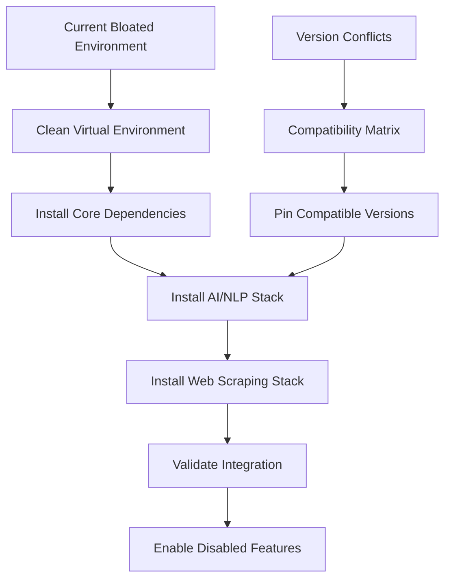
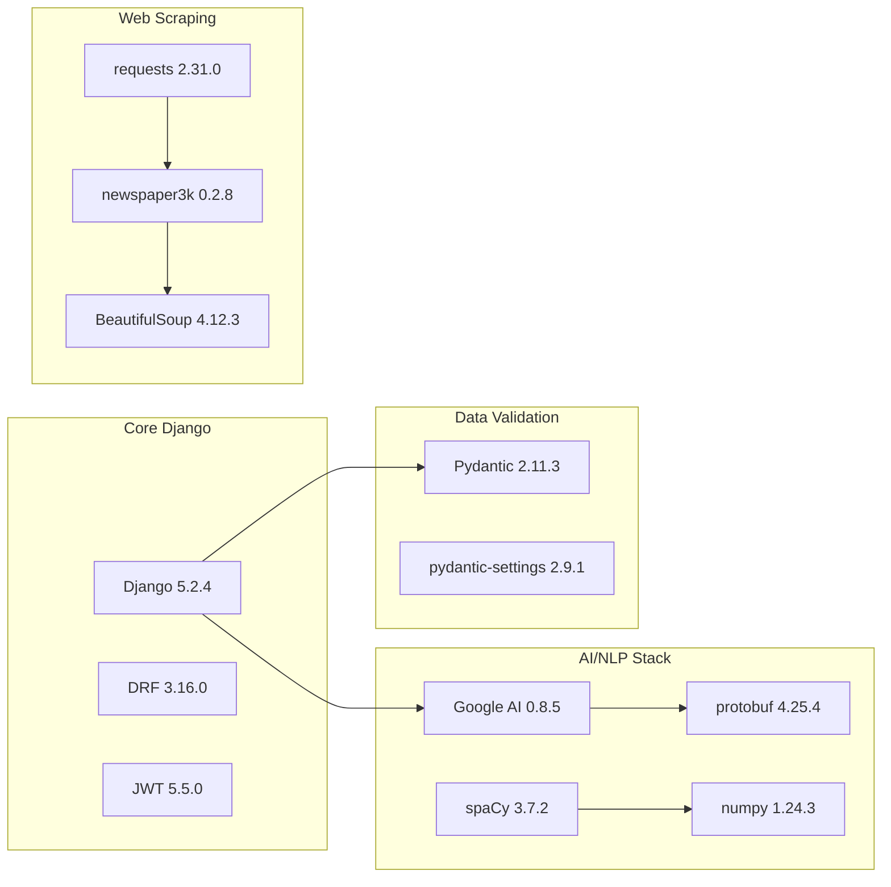

# Dependency Restoration Design

## Overview

This design addresses the systematic restoration of AI and NLP functionality in the VeriFast application by resolving dependency conflicts and implementing a clean, minimal dependency management strategy. The approach focuses on compatibility-first version selection and graceful degradation patterns.

## Architecture

### Dependency Resolution Strategy



### Component Dependencies



## Components and Interfaces

### 1. Dependency Management System

**Purpose**: Manage clean, minimal dependencies with version compatibility

**Key Components**:
- `requirements-clean.txt` - Production dependencies (25 packages)
- `requirements-dev.txt` - Development dependencies (separate)
- Version compatibility matrix
- Dependency validation scripts

**Interface**:
```bash
# Clean installation process
pip install -r requirements-clean.txt
python scripts/validate_dependencies.py
```

### 2. AI Service Restoration

**Purpose**: Restore Google Generative AI integration with proper error handling

**Key Components**:
- `verifast_app/services.py` - Restored AI functions
- Compatibility layer for protobuf versions
- Graceful degradation for API failures

**Interface**:
```python
# Restored function signature
def generate_master_analysis(
    model_name: str, 
    entity_list: list, 
    article_text: str
) -> dict:
    """
    Generates quiz and tags using Google Generative AI
    Returns: {'quiz': dict, 'tags': list}
    """
```

### 3. NLP Processing Restoration

**Purpose**: Restore spaCy-based entity extraction and text analysis

**Key Components**:
- spaCy model management
- Entity extraction pipeline
- Language detection and processing

**Interface**:
```python
# Restored function signature
def analyze_text_content(text: str, language: str = 'en') -> dict:
    """
    Performs NLP analysis on text
    Returns: {
        'reading_score': float,
        'people': list,
        'organizations': list,
        'money_mentions': list
    }
    """
```

### 4. Wikipedia Integration Restoration

**Purpose**: Restore Wikipedia API integration for tag validation

**Key Components**:
- Wikipedia API client with retry logic
- Tag canonicalization system
- Caching layer for API responses

**Interface**:
```python
# Restored function signature
def get_valid_wikipedia_tags(entities: list, language: str = 'en') -> list:
    """
    Validates entities against Wikipedia
    Returns: List[Tag] - Valid tag objects
    """
```

### 5. Web Scraping Restoration

**Purpose**: Restore newspaper3k-based article scraping

**Key Components**:
- Article extraction pipeline
- Content cleaning and validation
- Error handling for failed scrapes

**Interface**:
```python
# Restored function signature
@shared_task
def scrape_and_save_article(url: str) -> dict:
    """
    Scrapes article from URL and creates Article object
    Returns: {'status': str, 'article_id': int, 'message': str}
    """
```

## Data Models

### Dependency Configuration

```python
# config/dependency_config.py
from dataclasses import dataclass
from typing import Dict, List

@dataclass
class DependencyConfig:
    """Configuration for dependency management"""
    core_packages: Dict[str, str]
    ai_packages: Dict[str, str]
    optional_packages: Dict[str, str]
    compatibility_matrix: Dict[str, List[str]]
    
    def validate_compatibility(self) -> bool:
        """Validate package version compatibility"""
        pass
```

### Service Status Tracking

```python
# verifast_app/models.py (addition)
class ServiceStatus(models.Model):
    """Track status of external services"""
    service_name = models.CharField(max_length=50)
    is_available = models.BooleanField(default=False)
    last_check = models.DateTimeField(auto_now=True)
    error_message = models.TextField(blank=True)
    
    class Meta:
        verbose_name_plural = "Service Statuses"
```

## Error Handling

### Graceful Degradation Pattern

```python
# verifast_app/services.py
import logging
from functools import wraps

logger = logging.getLogger(__name__)

def with_fallback(fallback_return=None, log_error=True):
    """Decorator for graceful degradation"""
    def decorator(func):
        @wraps(func)
        def wrapper(*args, **kwargs):
            try:
                return func(*args, **kwargs)
            except ImportError as e:
                if log_error:
                    logger.warning(f"{func.__name__} disabled due to missing dependency: {e}")
                return fallback_return
            except Exception as e:
                if log_error:
                    logger.error(f"Error in {func.__name__}: {e}")
                return fallback_return
        return wrapper
    return decorator

@with_fallback(fallback_return={'quiz': {}, 'tags': []})
def generate_master_analysis(model_name: str, entity_list: list, article_text: str) -> dict:
    """AI analysis with fallback"""
    import google.generativeai as genai  # Import inside function
    # ... implementation
```

### Service Health Monitoring

```python
# verifast_app/health.py
from typing import Dict, Any
import logging

class ServiceHealthChecker:
    """Monitor health of external services"""
    
    def check_google_ai(self) -> Dict[str, Any]:
        """Check Google AI service availability"""
        try:
            import google.generativeai as genai
            # Simple test call
            return {'status': 'healthy', 'message': 'Google AI available'}
        except ImportError:
            return {'status': 'unavailable', 'message': 'Google AI not installed'}
        except Exception as e:
            return {'status': 'error', 'message': str(e)}
    
    def check_spacy(self) -> Dict[str, Any]:
        """Check spaCy service availability"""
        try:
            import spacy
            nlp = spacy.load("en_core_web_sm")
            return {'status': 'healthy', 'message': 'spaCy models loaded'}
        except ImportError:
            return {'status': 'unavailable', 'message': 'spaCy not installed'}
        except OSError:
            return {'status': 'error', 'message': 'spaCy models not downloaded'}
        except Exception as e:
            return {'status': 'error', 'message': str(e)}
```

## Testing Strategy

### Dependency Validation Tests

```python
# tests/test_dependencies.py
import pytest
import importlib

class TestDependencyAvailability:
    """Test that all required dependencies are available"""
    
    def test_core_dependencies(self):
        """Test core Django dependencies"""
        required = ['django', 'rest_framework', 'celery']
        for package in required:
            assert importlib.import_module(package)
    
    def test_ai_dependencies(self):
        """Test AI/NLP dependencies"""
        ai_packages = ['google.generativeai', 'spacy', 'numpy']
        for package in ai_packages:
            assert importlib.import_module(package)
    
    def test_version_compatibility(self):
        """Test that installed versions are compatible"""
        import requests
        import newspaper
        # Test that newspaper3k works with current requests version
        article = newspaper.Article('https://example.com')
        assert article is not None
```

### Integration Tests

```python
# tests/test_restored_services.py
import pytest
from unittest.mock import patch, MagicMock
from verifast_app.services import generate_master_analysis, analyze_text_content

class TestRestoredServices:
    """Test restored AI/NLP services"""
    
    @patch('verifast_app.services.genai')
    def test_generate_master_analysis_success(self, mock_genai):
        """Test successful AI analysis"""
        mock_response = MagicMock()
        mock_response.text = '{"quiz": {"questions": []}, "tags": ["test"]}'
        mock_genai.GenerativeModel.return_value.start_chat.return_value.send_message.return_value = mock_response
        
        result = generate_master_analysis("test-model", ["entity"], "test content")
        assert 'quiz' in result
        assert 'tags' in result
    
    def test_analyze_text_content_restored(self):
        """Test NLP analysis is working"""
        result = analyze_text_content("This is a test article about John Doe.")
        assert 'reading_score' in result
        assert 'people' in result
        assert 'organizations' in result
```

## Implementation Phases

### Phase 1: Environment Cleanup
1. Create new virtual environment
2. Install clean requirements
3. Validate core functionality

### Phase 2: AI Service Restoration
1. Fix protobuf version conflicts
2. Restore Google Generative AI integration
3. Add error handling and fallbacks

### Phase 3: NLP Service Restoration
1. Install compatible numpy/spacy versions
2. Download required spaCy models
3. Restore entity extraction functionality

### Phase 4: Web Services Restoration
1. Fix requests/newspaper3k compatibility
2. Restore Wikipedia API integration
3. Restore article scraping functionality

### Phase 5: Testing and Validation
1. Run comprehensive test suite
2. Validate end-to-end article processing
3. Monitor service health and performance

## Configuration Management

### Environment Variables

```bash
# .env (updated)
# AI Services
GEMINI_API_KEY=your_api_key_here
ENABLE_AI_FEATURES=true
AI_FALLBACK_MODE=graceful

# NLP Services
SPACY_MODEL_EN=en_core_web_sm
SPACY_MODEL_ES=es_core_news_sm
ENABLE_NLP_FEATURES=true

# External APIs
WIKIPEDIA_USER_AGENT=VeriFastApp/1.0
WIKIPEDIA_RATE_LIMIT=10
ENABLE_WIKIPEDIA_VALIDATION=true

# Service Health
HEALTH_CHECK_INTERVAL=300
LOG_SERVICE_ERRORS=true
```

### Feature Flags

```python
# config/feature_flags.py
from django.conf import settings

class FeatureFlags:
    """Centralized feature flag management"""
    
    @staticmethod
    def ai_features_enabled() -> bool:
        return getattr(settings, 'ENABLE_AI_FEATURES', False)
    
    @staticmethod
    def nlp_features_enabled() -> bool:
        return getattr(settings, 'ENABLE_NLP_FEATURES', False)
    
    @staticmethod
    def wikipedia_validation_enabled() -> bool:
        return getattr(settings, 'ENABLE_WIKIPEDIA_VALIDATION', False)
```

This design provides a systematic approach to restoring all disabled functionality while maintaining system stability through proper dependency management and graceful degradation patterns.