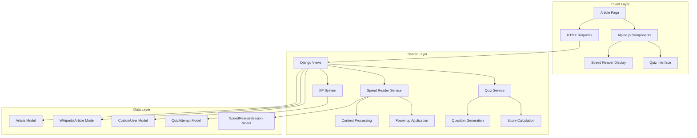
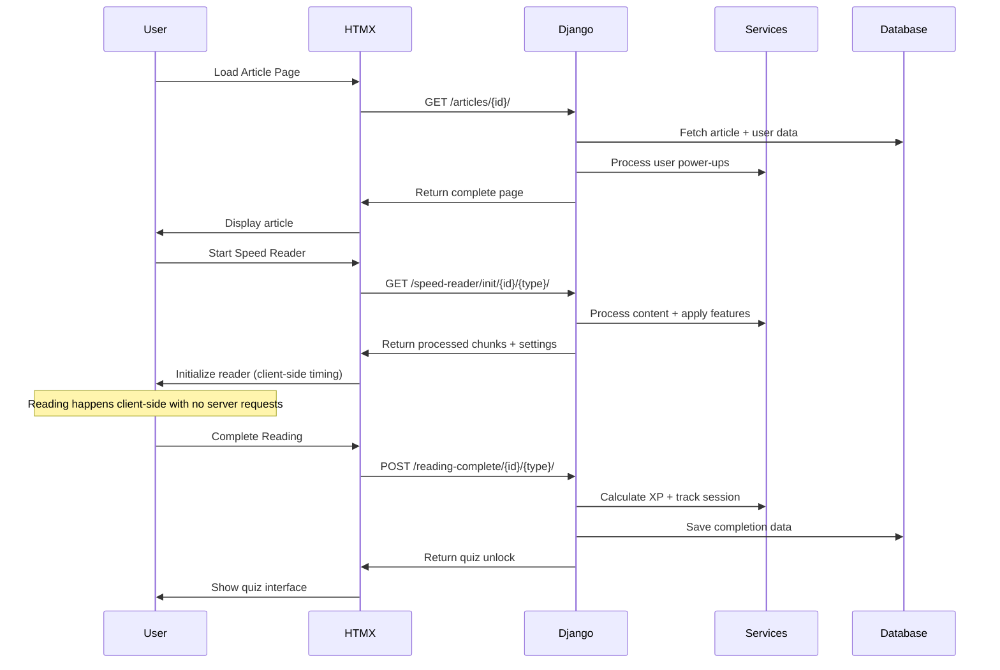

# Design Document

## Overview

The HTMX hybrid architecture refactor transforms VeriFast's article reading system from a complex JavaScript-heavy implementation to a server-side dominant approach with minimal client-side code. This design maintains all existing functionality while dramatically improving maintainability, performance, and debugging capabilities. The architecture works uniformly across regular articles and Wikipedia articles.

## Architecture

### Core Architectural Principles

1. **Server-Side Logic Dominance**: All business logic, gamification calculations, and user feature processing occurs in Django
2. **Minimal Network Communication**: Article content and processed data sent once, only completion events communicated back
3. **Progressive Enhancement**: Core functionality works without JavaScript, enhanced experience with minimal client-side code
4. **Unified Article Handling**: Same codebase and templates handle both regular and Wikipedia articles
5. **Hybrid Processing Model**: Server processes content based on user features, client handles timing and display

### System Architecture Diagram



### Request Flow Architecture



## Components and Interfaces

### 1. Speed Reader Service (Server-Side)

**Purpose**: Process article content based on user's purchased power-ups and preferences

```python
class SpeedReaderService:
    @staticmethod
    def prepare_content(article: Union[Article, WikipediaArticle], user: CustomUser) -> dict:
        """
        Process article content with user-specific features applied.
        
        Returns:
            {
                'word_chunks': List[str],
                'font_settings': dict,
                'reading_settings': dict,
                'total_words': int,
                'estimated_time': dict
            }
        """
    
    @staticmethod
    def get_chunked_words(content: str, user: CustomUser) -> List[str]:
        """Apply chunking based on user's power-ups (1-5 word chunks)"""
    
    @staticmethod
    def apply_smart_grouping(words: List[str]) -> List[str]:
        """Group connector words with adjacent words for better flow"""
    
    @staticmethod
    def get_font_settings(user: CustomUser) -> dict:
        """Generate CSS font settings based on user's customization power-ups"""
    
    @staticmethod
    def get_reading_settings(user: CustomUser) -> dict:
        """Configure reading behavior based on user's advanced features"""
```

### 2. Quiz Service (Server-Side)

**Purpose**: Handle quiz generation, processing, and scoring with user feature integration

```python
class QuizService:
    @staticmethod
    def prepare_quiz(article: Union[Article, WikipediaArticle], user: CustomUser) -> dict:
        """
        Prepare quiz with user-specific features applied.
        
        Returns:
            {
                'questions': List[dict],
                'total_questions': int,
                'time_limit': int,
                'features': dict
            }
        """
    
    @staticmethod
    def apply_user_quiz_features(quiz_data: List[dict], user: CustomUser) -> List[dict]:
        """Apply hints, explanations, randomization based on user power-ups"""
    
    @staticmethod
    def calculate_score(quiz_data: List[dict], user_answers: List[int]) -> dict:
        """Calculate score with detailed feedback and explanations"""
    
    @staticmethod
    def calculate_xp_reward(quiz_result: dict, article: Article, user: CustomUser) -> int:
        """Calculate XP based on performance, speed, and article difficulty"""
```

### 3. HTMX View Controllers

**Purpose**: Handle HTMX requests and coordinate between services and templates

```python
def speed_reader_init(request, article_id: int, article_type: str):
    """Initialize speed reader with preprocessed content"""
    
def speed_reader_complete(request, article_id: int, article_type: str):
    """Handle reading completion and unlock quiz"""
    
def quiz_init(request, article_id: int, article_type: str):
    """Initialize quiz with user-specific features"""
    
def quiz_submit(request, article_id: int, article_type: str):
    """Process quiz submission and calculate rewards"""
```

### 4. Alpine.js Speed Reader Component (Client-Side)

**Purpose**: Handle word display timing and user interactions with minimal JavaScript

```javascript
function speedReader(wordChunks, fontSettings, readingSettings, articleId, articleType) {
    return {
        // State (30 lines total)
        chunks: wordChunks,
        currentIndex: 0,
        currentChunk: 'Click Start to begin reading',
        isRunning: false,
        currentWpm: readingSettings.default_wpm,
        interval: null,
        
        // Methods
        toggleReading() { /* Start/pause logic */ },
        showNextWord() { /* Display next chunk */ },
        completeReading() { /* Notify server via HTMX */ },
        adjustSpeed(delta) { /* Change WPM locally */ }
    }
}
```

### 5. Alpine.js Quiz Component (Client-Side)

**Purpose**: Handle quiz interactions and submission with minimal JavaScript

```javascript
function quizHandler(questions, features, articleId, articleType) {
    return {
        // State (20 lines total)
        questions: questions,
        currentQuestion: 0,
        userAnswers: [],
        showHint: false,
        timeRemaining: features.time_limit,
        
        // Methods
        selectAnswer(index) { /* Record answer */ },
        nextQuestion() { /* Navigate questions */ },
        submitQuiz() { /* Send to server via HTMX */ },
        showHintForQuestion() { /* Display hint if available */ }
    }
}
```

## Data Models

### Enhanced Models for Session Tracking

```python
class SpeedReaderSession(models.Model):
    """Track individual speed reading sessions"""
    user = models.ForeignKey(CustomUser, on_delete=models.CASCADE)
    article_id = models.IntegerField()
    article_type = models.CharField(max_length=20, choices=[('regular', 'Regular'), ('wikipedia', 'Wikipedia')])
    start_time = models.DateTimeField(auto_now_add=True)
    end_time = models.DateTimeField(null=True, blank=True)
    initial_wpm = models.IntegerField()
    final_wpm = models.IntegerField(null=True, blank=True)
    reading_time_seconds = models.IntegerField(null=True, blank=True)
    pause_count = models.IntegerField(default=0)
    completed = models.BooleanField(default=False)
    
class QuizAttempt(models.Model):
    """Enhanced quiz attempt tracking"""
    user = models.ForeignKey(CustomUser, on_delete=models.CASCADE)
    article_id = models.IntegerField()
    article_type = models.CharField(max_length=20, choices=[('regular', 'Regular'), ('wikipedia', 'Wikipedia')])
    score = models.FloatField()
    time_taken_seconds = models.IntegerField()
    xp_awarded = models.IntegerField()
    detailed_results = models.JSONField()  # Store question-by-question results
    created_at = models.DateTimeField(auto_now_add=True)
```

### Unified Article Interface

```python
class ArticleInterface:
    """Common interface for both Article and WikipediaArticle"""
    
    @property
    def content(self) -> str:
        """Article content for speed reading"""
    
    @property
    def quiz_data(self) -> List[dict]:
        """Quiz questions and answers"""
    
    @property
    def word_count(self) -> int:
        """Total word count for time estimation"""
    
    @property
    def reading_level(self) -> float:
        """Difficulty level for XP calculation"""
```

## Error Handling

### Server-Side Error Handling

```python
class SpeedReaderError(Exception):
    """Custom exception for speed reader issues"""
    pass

class QuizProcessingError(Exception):
    """Custom exception for quiz processing issues"""
    pass

def handle_speed_reader_error(func):
    """Decorator for graceful speed reader error handling"""
    def wrapper(*args, **kwargs):
        try:
            return func(*args, **kwargs)
        except SpeedReaderError as e:
            logger.error(f"Speed reader error: {e}")
            return render(request, 'partials/speed_reader_error.html', {
                'error_message': str(e)
            })
        except Exception as e:
            logger.error(f"Unexpected error in speed reader: {e}")
            return render(request, 'partials/speed_reader_fallback.html')
    return wrapper
```

### Client-Side Error Handling

```javascript
// HTMX error handling
document.addEventListener('htmx:responseError', function(event) {
    console.error('HTMX Error:', event.detail);
    showUserFriendlyError('Something went wrong. Please try again.');
});

// Alpine.js error boundaries
function safeSpeedReader(wordChunks, fontSettings, readingSettings, articleId, articleType) {
    try {
        return speedReader(wordChunks, fontSettings, readingSettings, articleId, articleType);
    } catch (error) {
        console.error('Speed Reader Error:', error);
        return fallbackSpeedReader();
    }
}
```

### Progressive Degradation

```html
<!-- Fallback for when JavaScript fails -->
<noscript>
    <div class="fallback-reader">
        <h3>Speed Reader Unavailable</h3>
        <p>JavaScript is required for the speed reader. You can still read the article normally below.</p>
        <div class="article-content">{{ article.content }}</div>
    </div>
</noscript>

<!-- Fallback for when HTMX fails -->
<div id="htmx-fallback" style="display: none;">
    <form method="post" action="">
        
        <!-- Traditional form submission as fallback -->
    </form>
</div>
```

## Testing Strategy

### Server-Side Testing

```python
class SpeedReaderServiceTest(TestCase):
    def test_content_processing_with_power_ups(self):
        """Test content chunking with various user power-ups"""
        
    def test_font_settings_generation(self):
        """Test CSS generation for user font preferences"""
        
    def test_unified_article_handling(self):
        """Test same processing for Article and WikipediaArticle"""

class HTMXViewTest(TestCase):
    def test_speed_reader_init_response(self):
        """Test HTMX response format and content"""
        
    def test_quiz_submission_processing(self):
        """Test quiz scoring and XP calculation"""
        
    def test_error_handling_responses(self):
        """Test graceful error responses for HTMX"""
```

### Client-Side Testing

```javascript
// Alpine.js component testing
describe('Speed Reader Component', () => {
    test('initializes with correct default state', () => {
        // Test component initialization
    });
    
    test('handles word progression correctly', () => {
        // Test timing and word display
    });
    
    test('communicates completion to server', () => {
        // Test HTMX integration
    });
});

// HTMX integration testing
describe('HTMX Integration', () => {
    test('loads speed reader interface', () => {
        // Test HTMX request/response cycle
    });
    
    test('handles server errors gracefully', () => {
        // Test error handling
    });
});
```

### Performance Testing

```python
class PerformanceTest(TestCase):
    def test_content_processing_speed(self):
        """Ensure content processing completes under 100ms"""
        
    def test_quiz_scoring_performance(self):
        """Ensure quiz scoring completes under 50ms"""
        
    def test_concurrent_user_handling(self):
        """Test system under multiple simultaneous users"""
```

## Implementation Considerations

### Performance Optimizations

1. **Content Preprocessing**: Process and cache word chunks for popular articles
2. **Template Fragment Caching**: Cache static portions of article templates
3. **Database Optimization**: Use select_related and prefetch_related for user data
4. **CDN Integration**: Serve static assets from CDN for faster loading

### Security Measures

1. **Input Validation**: Validate all user inputs server-side
2. **CSRF Protection**: Include CSRF tokens in all HTMX requests
3. **XSS Prevention**: Escape all user-generated content
4. **Rate Limiting**: Prevent abuse of quiz and reading endpoints

### Accessibility Features

1. **Keyboard Navigation**: Full keyboard support for all interactions
2. **Screen Reader Support**: Proper ARIA labels and live regions
3. **High Contrast Mode**: Support for user's high contrast power-up
4. **Focus Management**: Proper focus handling during HTMX updates

### Mobile Responsiveness

1. **Touch Targets**: Appropriate sizing for mobile interactions
2. **Responsive Layout**: Flexible design that works on all screen sizes
3. **Performance**: Optimized for mobile network conditions
4. **Progressive Web App**: Service worker for offline functionality

This design provides a robust foundation for the HTMX hybrid architecture while maintaining all existing functionality and improving system maintainability, performance, and user experience across both regular and Wikipedia articles.