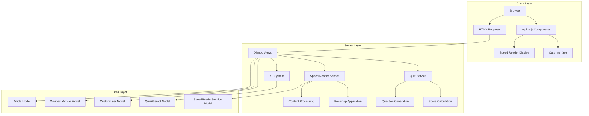
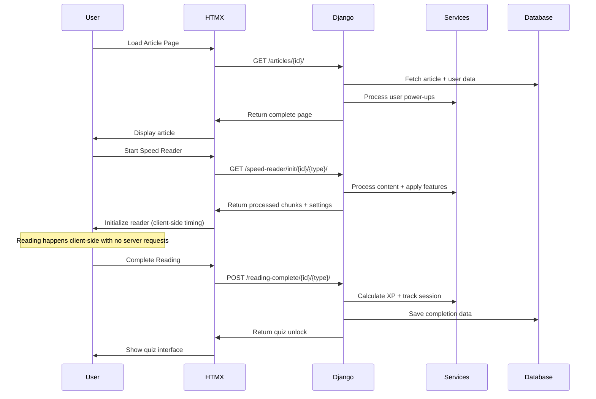

# VeriFast Project Architecture Guide

*Last Updated: July 27, 2025*  
*Status: HTMX Hybrid Architecture*

## Overview

VeriFast is a Django-based web application that uses HTMX hybrid architecture for speed reading functionality with gamification elements, AI-powered quizzes, and social features. This guide provides comprehensive architectural guidance for developers working on the project.

## Core Architecture Principles

### 1. HTMX Hybrid Approach
- **Server-Side Dominance**: All business logic, gamification, and content processing in Django
- **Minimal Client JavaScript**: 30 lines of Alpine.js for timing and display only
- **Progressive Enhancement**: Core functionality works without JavaScript
- **Network Optimization**: Minimal requests with maximum server-side processing

### 2. Technology Stack
- **Backend**: Django 5.2.4 with Python 3.10+
- **Database**: PostgreSQL (production), SQLite (development)
- **Frontend**: HTMX + Alpine.js + PicoCSS
- **Background Processing**: Celery with Redis broker
- **AI Integration**: Google Gemini API
- **External APIs**: Wikipedia API

## System Architecture

### High-Level Architecture



### Request Flow Architecture



## Directory Structure

```
verifast/
├── config/                     # Django project configuration
│   ├── settings.py            # Environment-based settings
│   ├── urls.py               # Root URL routing
│   ├── celery.py             # Background task config
│   └── wsgi.py/asgi.py       # Server interfaces
├── verifast_app/              # Main application
│   ├── models.py             # Database models
│   ├── views.py              # HTMX view controllers
│   ├── services.py           # Business logic services
│   ├── xp_system.py          # Gamification engine
│   ├── tasks.py              # Celery background tasks
│   ├── api_views.py          # REST API endpoints
│   ├── templates/            # HTMX templates
│   │   ├── verifast_app/     # Main templates
│   │   └── partials/         # HTMX partial templates
│   ├── static/               # CSS, minimal JavaScript, images
│   │   ├── verifast_app/
│   │   │   ├── css/          # PicoCSS extensions
│   │   │   ├── js/           # Minimal Alpine.js components
│   │   │   └── images/       # Static images
│   └── migrations/           # Database migrations
├── core/                      # Shared utilities
├── documentation/            # Comprehensive documentation
├── .kiro/                    # Kiro IDE specifications
└── requirements.txt          # Python dependencies
```

## Core Components

### 1. HTMX Views Layer

**Purpose**: Handle HTMX requests and coordinate between services and templates

```python
# verifast_app/views.py
def speed_reader_init(request, article_id, article_type='regular'):
    """Initialize speed reader with preprocessed content"""
    if article_type == 'wikipedia':
        article = get_object_or_404(WikipediaArticle, id=article_id)
    else:
        article = get_object_or_404(Article, id=article_id)
    
    user = request.user if request.user.is_authenticated else None
    content_data = SpeedReaderService.prepare_content(article, user)
    
    return render(request, 'partials/speed_reader_active.html', {
        'word_chunks_json': json.dumps(content_data['word_chunks']),
        'font_settings': content_data['font_settings'],
        'reading_settings': content_data['reading_settings'],
        'article_id': article_id,
        'article_type': article_type,
        'total_words': content_data['total_words']
    })

def speed_reader_complete(request, article_id, article_type='regular'):
    """Handle reading completion and unlock quiz"""
    if request.user.is_authenticated:
        # Track completion and award XP
        xp_awarded = calculate_reading_xp(request.user, article_id, article_type)
        request.user.total_xp += xp_awarded
        request.user.current_xp_points += xp_awarded
        request.user.save()
    
    return render(request, 'partials/quiz_unlock.html', {
        'article_id': article_id,
        'article_type': article_type,
        'xp_awarded': xp_awarded if request.user.is_authenticated else 0
    })
```

### 2. Services Layer

**Purpose**: Encapsulate business logic and content processing

```python
# verifast_app/services.py
class SpeedReaderService:
    @staticmethod
    def prepare_content(article, user):
        """Prepare article content with user-specific processing"""
        content = SpeedReaderService.clean_content(article.content)
        word_chunks = SpeedReaderService.get_chunked_words(content, user)
        font_settings = SpeedReaderService.get_font_settings(user)
        reading_settings = SpeedReaderService.get_reading_settings(user)
        
        return {
            'word_chunks': word_chunks,
            'font_settings': font_settings,
            'reading_settings': reading_settings,
            'total_words': len(word_chunks),
            'estimated_time': SpeedReaderService.estimate_reading_time(word_chunks, user)
        }
    
    @staticmethod
    def get_chunked_words(content, user):
        """Apply user's power-ups to create word chunks"""
        words = content.split()
        
        # Apply smart grouping if user has the power-up
        if user and user.has_smart_connector_grouping:
            words = SpeedReaderService.apply_smart_grouping(words)
        
        # Determine chunk size based on purchased power-ups
        chunk_size = SpeedReaderService.get_user_chunk_size(user)
        
        return SpeedReaderService.create_word_chunks(words, chunk_size)
```

### 3. Template Architecture

**Base Template Structure:**
```html
<!-- verifast_app/templates/verifast_app/base.html -->
<!DOCTYPE html>
<html lang="{{ LANGUAGE_CODE }}">
<head>
    <meta charset="UTF-8">
    <meta name="viewport" content="width=device-width, initial-scale=1.0">
    <title>VeriFast</title>
    
    <!-- PicoCSS Framework -->
    <link rel="stylesheet" href="https://cdn.jsdelivr.net/npm/@picocss/pico@2/css/pico.min.css">
    
    <!-- Custom CSS -->
    <link rel="stylesheet" href="">
    
    <!-- HTMX -->
    <script src="https://unpkg.com/htmx.org@1.9.10"></script>
    
    <!-- Alpine.js (minimal usage) -->
    <script defer src="https://cdn.jsdelivr.net/npm/alpinejs@3.x.x/dist/cdn.min.js"></script>
    
    
</head>
<body>
    <header>
        
    </header>
    
    <main class="container">
        
    </main>
    
    <footer>
        
    </footer>
    
    <!-- Minimal JavaScript blocks -->
    
</body>
</html>
```

**HTMX Partial Templates:**
```html
<!-- verifast_app/templates/partials/speed_reader_active.html -->
<div id="speed-reader-active" 
     x-data="speedReader({{ word_chunks_json|safe }}, {{ font_settings|safe }}, {{ reading_settings|safe }}, '{{ article_id }}', '{{ article_type }}')"
     class="speed-reader-active">
    
    <!-- Word Display -->
    <div class="word-display" 
         :style="wordDisplayStyles"
         x-text="currentChunk">
        Click Start to begin reading
    </div>
    
    <!-- Progress Bar -->
    <div class="progress-container">
        <div class="progress-bar">
            <div class="progress-fill" :style="`width: ${progress}%`"></div>
        </div>
        <div class="progress-text">
            <span x-text="currentIndex"></span> / <span x-text="totalChunks"></span>
            (<span x-text="Math.round(progress)"></span>%)
        </div>
    </div>
    
    <!-- Controls -->
    <div class="reader-controls">
        <button @click="toggleReading()" class="primary">
            <span x-text="isRunning ? 'Pause' : 'Start Reading'"></span>
        </button>
        <button @click="resetReading()">Reset</button>
        <button @click="toggleImmersive()" x-show="hasImmersiveMode">
            Immersive Mode
        </button>
    </div>
</div>
```

### 4. Minimal JavaScript Architecture

**Alpine.js Components (30 lines total):**
```javascript
// static/verifast_app/js/speed-reader.js
function speedReader(wordChunks, fontSettings, readingSettings, articleId, articleType) {
    return {
        // State
        chunks: wordChunks,
        currentIndex: 0,
        currentChunk: 'Click Start to begin reading',
        isRunning: false,
        currentWpm: readingSettings.default_wpm,
        interval: null,
        
        // Computed properties
        get progress() {
            return this.chunks.length > 0 ? (this.currentIndex / this.chunks.length) * 100 : 0;
        },
        
        get wordDisplayStyles() {
            return {
                fontFamily: fontSettings.font_family,
                fontSize: fontSettings.font_size,
                fontWeight: fontSettings.font_weight,
                letterSpacing: fontSettings.letter_spacing
            };
        },
        
        // Methods
        toggleReading() {
            this.isRunning ? this.pauseReading() : this.startReading();
        },
        
        startReading() {
            this.isRunning = true;
            const intervalMs = 60000 / this.currentWpm;
            this.interval = setInterval(() => this.showNextWord(), intervalMs);
        },
        
        showNextWord() {
            if (this.currentIndex < this.chunks.length) {
                this.currentChunk = this.chunks[this.currentIndex];
                this.currentIndex++;
            } else {
                this.completeReading();
            }
        },
        
        completeReading() {
            this.pauseReading();
            // Notify server via HTMX
            htmx.ajax('POST', `/reading-complete/${articleId}/${articleType}/`, {
                target: '#quiz-section',
                swap: 'innerHTML'
            });
        }
    }
}
```

## Data Models

### Core Models

```python
# verifast_app/models.py
class CustomUser(AbstractUser):
    """Extended user model with gamification features"""
    current_wpm = models.PositiveIntegerField(
        default=250,
        help_text="User's current words-per-minute reading speed"
    )
    total_xp = models.PositiveIntegerField(
        default=0,
        help_text="Total XP earned by the user"
    )
    current_xp_points = models.PositiveIntegerField(
        default=0,
        help_text="Current spendable XP points"
    )
    
    # Power-up fields
    has_2word_chunking = models.BooleanField(default=False)
    has_3word_chunking = models.BooleanField(default=False)
    has_smart_connector_grouping = models.BooleanField(default=False)
    has_font_customization = models.BooleanField(default=False)
    has_immersive_mode = models.BooleanField(default=False)

class Article(models.Model):
    """Main content articles for speed reading"""
    title = models.CharField(max_length=200)
    content = models.TextField()
    quiz_data = models.JSONField(default=list)
    reading_level = models.FloatField(null=True, blank=True)
    word_count = models.PositiveIntegerField(default=0)
    processing_status = models.CharField(max_length=20, default='pending')

class SpeedReaderSession(models.Model):
    """Track individual speed reading sessions"""
    user = models.ForeignKey(CustomUser, on_delete=models.CASCADE)
    article_id = models.IntegerField()
    article_type = models.CharField(max_length=20, choices=[
        ('regular', 'Regular'),
        ('wikipedia', 'Wikipedia')
    ])
    start_time = models.DateTimeField(auto_now_add=True)
    end_time = models.DateTimeField(null=True, blank=True)
    initial_wpm = models.IntegerField()
    final_wpm = models.IntegerField(null=True, blank=True)
    completed = models.BooleanField(default=False)
```

## URL Patterns

### HTMX Endpoints

```python
# verifast_app/urls.py
from django.urls import path
from . import views

app_name = 'verifast_app'

urlpatterns = [
    # Main pages
    path('', views.IndexView.as_view(), name='index'),
    path('articles/<int:pk>/', views.ArticleDetailView.as_view(), name='article_detail'),
    path('wikipedia/<int:pk>/', views.WikipediaArticleDetailView.as_view(), name='wikipedia_article_detail'),
    
    # HTMX endpoints
    path('speed-reader/init/<int:article_id>/<str:article_type>/', 
         views.speed_reader_init, name='speed_reader_init'),
    path('reading-complete/<int:article_id>/<str:article_type>/', 
         views.speed_reader_complete, name='reading_complete'),
    path('quiz/init/<int:article_id>/<str:article_type>/', 
         views.quiz_init, name='quiz_init'),
    path('quiz/submit/<int:article_id>/<str:article_type>/', 
         views.quiz_submit, name='quiz_submit'),
    
    # API endpoints
    path('api/', include('verifast_app.api_urls')),
]
```

## Performance Characteristics

### Network Optimization
| Metric | Old JavaScript | HTMX Hybrid |
|--------|---------------|-------------|
| Initial Load | 1 request | 1 request |
| Speed Reader Init | 1 request | 1 request |
| During Reading | 100+ requests | 0 requests |
| Reading Complete | 1 request | 1 request |
| Quiz Init | 1 request | 1 request |
| Quiz Submit | 1 request | 1 request |
| **Total per Session** | **104+ requests** | **5 requests** |

### Code Complexity
| Metric | Old Approach | HTMX Hybrid |
|--------|-------------|-------------|
| JavaScript Lines | 500+ lines | 30 lines |
| External Dependencies | Multiple | Alpine.js only |
| Debugging Complexity | High | Low |
| Maintenance Burden | High | Minimal |

## Development Workflow

### 1. Backend-First Development
1. **Design Models**: Define data structures and relationships
2. **Create Services**: Implement business logic in service classes
3. **Build Views**: Create HTMX view controllers
4. **Write Tests**: Comprehensive backend testing

### 2. Template Development
1. **Create Partials**: Build HTMX partial templates
2. **Design Components**: Create reusable template components
3. **Add Styling**: Extend PicoCSS with custom styles
4. **Test Responsiveness**: Ensure mobile compatibility

### 3. Minimal Frontend Enhancement
1. **Alpine.js Components**: Add minimal client-side reactivity
2. **HTMX Integration**: Connect templates to server endpoints
3. **Progressive Enhancement**: Ensure fallbacks work
4. **Accessibility**: Add ARIA labels and keyboard support

## Testing Strategy

### Backend Testing
```python
# tests/test_speed_reader.py
class SpeedReaderServiceTest(TestCase):
    def test_content_chunking_with_power_ups(self):
        user = self.create_user_with_chunking_power_up()
        chunks = SpeedReaderService.get_chunked_words("test content", user)
        self.assertEqual(len(chunks), expected_chunk_count)
    
    def test_font_settings_generation(self):
        user = self.create_user_with_font_customization()
        settings = SpeedReaderService.get_font_settings(user)
        self.assertEqual(settings['font_family'], user.preferred_font)

class HTMXViewTest(TestCase):
    def test_speed_reader_init_response(self):
        response = self.client.get(f'/speed-reader/init/{self.article.id}/regular/')
        self.assertEqual(response.status_code, 200)
        self.assertContains(response, 'word_chunks_json')
```

### Frontend Testing
```javascript
// Test Alpine.js components in browser console
describe('Speed Reader Component', () => {
    test('initializes with correct state', () => {
        const reader = speedReader(['hello', 'world'], {}, {}, 1, 'regular');
        expect(reader.currentChunk).toBe('Click Start to begin reading');
    });
    
    test('progresses through words correctly', () => {
        const reader = speedReader(['hello', 'world'], {}, {}, 1, 'regular');
        reader.startReading();
        // Test word progression
    });
});
```

## Security Considerations

### HTMX Security
- **CSRF Protection**: All POST requests include CSRF tokens
- **Input Validation**: Server-side validation for all user inputs
- **XSS Prevention**: Proper escaping of user-generated content
- **Rate Limiting**: Prevent abuse of interactive endpoints

### Authentication
- **Session-Based**: Django's built-in session authentication
- **Permission Checks**: Verify user permissions for premium features
- **Secure Headers**: HTTPS, HSTS, and other security headers

## Deployment Architecture

### Production Setup
```python
# settings/production.py
ALLOWED_HOSTS = ['yourdomain.com']

# Security settings
SECURE_SSL_REDIRECT = True
SECURE_HSTS_SECONDS = 31536000
SESSION_COOKIE_SECURE = True
CSRF_COOKIE_SECURE = True

# Static files
STATIC_ROOT = '/var/www/static/'
STATICFILES_STORAGE = 'whitenoise.storage.CompressedManifestStaticFilesStorage'

# Database
DATABASES = {
    'default': {
        'ENGINE': 'django.db.backends.postgresql',
        'NAME': os.environ.get('DB_NAME'),
        'USER': os.environ.get('DB_USER'),
        'PASSWORD': os.environ.get('DB_PASSWORD'),
        'HOST': os.environ.get('DB_HOST'),
        'PORT': os.environ.get('DB_PORT'),
    }
}

# Caching
CACHES = {
    'default': {
        'BACKEND': 'django_redis.cache.RedisCache',
        'LOCATION': os.environ.get('REDIS_URL'),
        'OPTIONS': {
            'CLIENT_CLASS': 'django_redis.client.DefaultClient',
        }
    }
}
```

## Monitoring and Maintenance

### Performance Monitoring
```python
# Add performance logging
import time
import logging

logger = logging.getLogger(__name__)

def monitor_view_performance(view_func):
    def wrapper(request, *args, **kwargs):
        start_time = time.time()
        response = view_func(request, *args, **kwargs)
        duration = time.time() - start_time
        
        if duration > 1.0:  # Log slow requests
            logger.warning(f"Slow request: {view_func.__name__} took {duration:.2f}s")
        
        return response
    return wrapper
```

### Health Checks
```python
# Health check endpoint
def health_check(request):
    health_status = {
        'status': 'healthy',
        'timestamp': timezone.now().isoformat(),
        'services': {}
    }
    
    # Database check
    try:
        with connection.cursor() as cursor:
            cursor.execute("SELECT 1")
        health_status['services']['database'] = 'healthy'
    except Exception as e:
        health_status['services']['database'] = f'unhealthy: {str(e)}'
        health_status['status'] = 'unhealthy'
    
    status_code = 200 if health_status['status'] == 'healthy' else 503
    return JsonResponse(health_status, status=status_code)
```

## Related Documentation
- [HTMX Hybrid Architecture Spec](../.kiro/specs/htmx-hybrid-architecture/)
- [Speed Reader Feature](features/speed-reader.md)
- [XP System](features/xp-system.md)
- [API Specification](api/specification.md)
- [HTMX Debugging Guide](troubleshooting/htmx-debugging-guide.md)

This architecture guide provides comprehensive guidance for developing and maintaining the VeriFast HTMX hybrid architecture, emphasizing server-side processing, minimal client-side code, and robust performance characteristics.