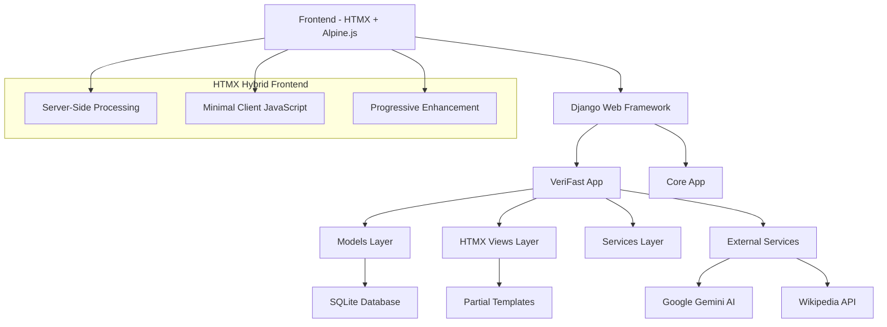

# VeriFast Architecture Overview

*Last Updated: July 27, 2025*
*Status: HTMX Hybrid Architecture*

## System Architecture

VeriFast is a Django-based web application that uses HTMX hybrid architecture for speed reading functionality with gamification elements, AI-powered quizzes, and social features. The system emphasizes server-side processing with minimal client-side JavaScript.

## High-Level Architecture



## Core Components

### 1. Django Applications

#### VeriFast App (`verifast_app/`)
- **Primary application** containing main functionality
- User management, articles, quizzes, XP system
- Tag system with Wikipedia integration
- Social features (comments, interactions)

#### Core App (`core/`)
- **Shared utilities** and base functionality
- Common models and utilities

#### Config (`config/`)
- **Django settings** and configuration
- URL routing and WSGI/ASGI configuration

### 2. Key Models

#### User Management
- `CustomUser` - Extended user model with XP points and preferences
- `UserProfile` - Additional user profile information

#### Content Management
- `Article` - Main content articles for speed reading
- `Tag` - Wikipedia-validated content tags
- `Comment` - User comments on articles

#### Gamification
- `QuizAttempt` - User quiz attempts and scores
- `XPTransaction` - XP earning and spending records
- `FeaturePurchase` - Premium feature purchases

### 3. Core Systems

#### XP System (`xp_system.py`)
- **XP Calculation Engine** - Calculates XP rewards
- **Transaction Manager** - Handles XP earning/spending
- **Validation Manager** - Ensures XP transaction integrity
- **Cache Manager** - Performance optimization
- **Monitoring Manager** - Analytics and reporting

#### Tag System (`tag_analytics.py`, `wikipedia_service.py`)
- **Wikipedia Integration** - Validates tags against Wikipedia
- **Tag Analytics** - Popularity and relationship analysis
- **Search and Discovery** - Tag-based content discovery

#### Speed Reader
- **Immersive Reading Mode** - Full-screen reading experience
- **Word Chunking** - Configurable word grouping
- **WPM Tracking** - Reading speed measurement

## Data Flow

### 1. User Registration/Authentication
```
User Registration → CustomUser Creation → Profile Setup → XP Initialization
```

### 2. Article Reading Flow
```
Article Selection → Speed Reader → Reading Completion → Quiz Generation → XP Reward
```

### 3. Tag System Flow
```
Tag Creation → Wikipedia Validation → Content Association → Search Indexing
```

## External Integrations

### Google Gemini AI
- **Quiz Generation** - Creates comprehension quizzes from articles
- **Content Analysis** - Analyzes article difficulty and topics
- **API Integration** - Secure API key management

### Wikipedia API
- **Tag Validation** - Verifies tag authenticity
- **Content Enrichment** - Adds Wikipedia articles for tags
- **Disambiguation** - Handles ambiguous tag names

## Security Architecture

### Authentication
- Django's built-in authentication system
- Session-based authentication for web interface
- Token-based authentication for API access

### Data Protection
- CSRF protection on all forms
- SQL injection prevention through Django ORM
- XSS protection through template escaping

### API Security
- Rate limiting on API endpoints
- Input validation and sanitization
- Secure API key storage for external services

## Performance Considerations

### Caching Strategy
- **View Caching** - Cache expensive page renders
- **Query Optimization** - Use select_related and prefetch_related
- **XP System Caching** - Cache user XP data for performance

### Database Optimization
- **Indexes** - Strategic database indexes on frequently queried fields
- **Query Optimization** - Minimize N+1 queries
- **Connection Pooling** - Efficient database connection management

## Scalability

### Current Architecture
- **Single Server** - Suitable for current scale
- **SQLite Database** - Appropriate for development and small deployments
- **File-based Static Serving** - Simple static file management

### Future Scaling Options
- **Database Migration** - PostgreSQL for production
- **Caching Layer** - Redis for session and data caching
- **Load Balancing** - Multiple application servers
- **CDN Integration** - Static file distribution

## Related Documentation
- [Technical Specification](../Technical-Specification.md)
- [Models Documentation](models.md)
- [API Documentation](../api/specification.md)