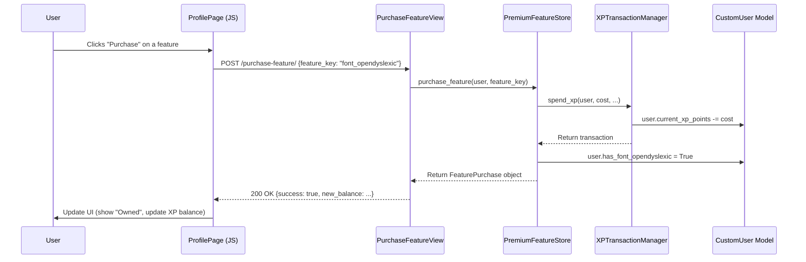

**Architecture Overview**

The implementation will primarily leverage the existing `xp_system.py` module, which already contains the necessary classes (`PremiumFeatureStore`, `XPCalculationEngine`, `SocialInteractionManager`). The main effort will be to integrate these services into the frontend templates and views, and to modify the JavaScript for the speed reader to respect the newly purchased features.

**Key Decisions**

1.  **Frontend Integration:** The feature store will be a new component within the user profile template (`user_profile.html`). It will fetch feature data from a new context processor or view and use AJAX calls to the existing `PurchaseFeatureView` to handle purchases.
2.  **Dynamic Speed Reader:** The speed reader's JavaScript will be modified to dynamically enable/disable controls (font selection, chunking dropdowns) based on the user's purchased features, which will be passed from the Django view to the template.
3.  **Data Model Activation:** The boolean fields on the `CustomUser` model (e.g., `has_font_opensans`) are already in place and will serve as the single source of truth for feature ownership.

**Component Modifications**

1.  **`verifast_app/xp_system.py`:**
    *   The `XPCalculationEngine.calculate_quiz_xp` method will be finalized to include all specified bonuses (perfect score, WPM improvement).
    *   The `SocialInteractionManager.INTERACTION_COSTS` dictionary will be updated to the new, refined values (Bronze: 5, Silver: 15, Gold: 30).

2.  **`verifast_app/views.py`:**
    *   `UserProfileView`: The `get_context_data` method will be updated to call `PremiumFeatureStore.get_available_features(user)` and pass the list of features to the template.
    *   `ArticleDetailView`: The `post` method for quiz submission is already using the `QuizResultProcessor`, which will now return the new bonus information. The view will be updated to display this. The `get_context_data` method will be updated to pass the user's owned features to the speed reader template context.

3.  **`verifast_app/templates/verifast_app/user_profile.html`:**
    *   A new section for the "Premium Feature Store" will be added.
    *   It will loop through the features provided by the view.
    *   Each feature will have a "Purchase" button that triggers an AJAX call to the `/purchase-feature/` endpoint.

4.  **`verifast_app/templates/verifast_app/article_detail.html`:**
    *   The speed reader's JavaScript will be modified. It will check for variables in the template context (e.g., `user_owns_3_word_chunking`) to enable or disable the corresponding `<option>` in the chunking dropdown.
    *   A new section will be added to display the "Perfect Score" recommendations after a quiz is completed with 100%.

**API Endpoints (No new endpoints needed)**

*   The existing `POST /purchase-feature/` view will be used.
*   The `POST /api/v1/articles/{id}/quiz/submit/` endpoint will automatically use the updated `QuizResultProcessor` and return the new, detailed XP breakdown.

**Sequence Diagram: Feature Purchase**

