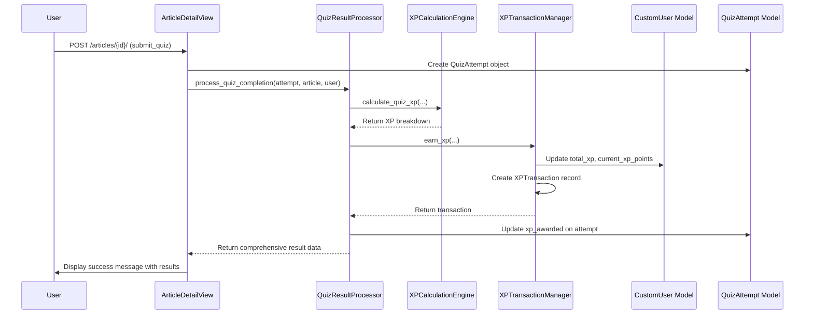

**Architecture Overview**

The refactoring will modify the `verifast_app.views.py` file to replace direct calls to the legacy `gamification.py` module with calls to the new, more robust services in `xp_system.py`. This change aligns the application with a service-oriented architecture, where complex business logic is encapsulated in dedicated manager classes (`QuizResultProcessor`, `SocialInteractionManager`, `XPTransactionManager`).

**Key Decisions**

1.  **Single Point of Entry:** All XP-related calculations and social interactions will be channeled through the manager classes in `xp_system.py`. This ensures consistency and makes future updates easier.
2.  **Atomic Transactions:** All operations that modify user XP or create related records (like `Comment` or `QuizAttempt`) will be wrapped in `django.db.transaction.atomic` blocks within the service layer (`xp_system.py`) to ensure data integrity.
3.  **Deprecation Path:** The `gamification.py` file will be marked for deprecation and eventually removed. For now, its functions will be modified to log a warning if ever called.

**Modified Components**

1.  **`verifast_app/views.py`:**
    *   The `ArticleDetailView.post` method will be significantly refactored.
        *   The quiz submission logic will no longer calculate XP directly. It will create a `QuizAttempt` object and then pass it to `QuizResultProcessor.process_quiz_completion`.
        *   The comment submission logic will be updated to call `SocialInteractionManager.post_comment`, which handles XP deduction and transaction logging.
    *   The `CommentInteractView.post` method will be refactored to use `SocialInteractionManager.add_interaction`.

2.  **`verifast_app/api_views.py`:**
    *   The `submit_quiz` function will be refactored similarly to the web view, using `QuizResultProcessor`.
    *   The `post_article_comment` and `interact_with_comment_view` functions will be updated to use the `SocialInteractionManager`.

3.  **`verifast_app/xp_system.py`:**
    *   This module will become the single source of truth for all gamification logic. No changes are needed in this file, as it is already built to handle these requirements.

4.  **`verifast_app/gamification.py`:**
    *   This file will be kept temporarily for reference but its functions will be replaced.

**Sequence Diagram: Quiz Submission (Refactored)**

